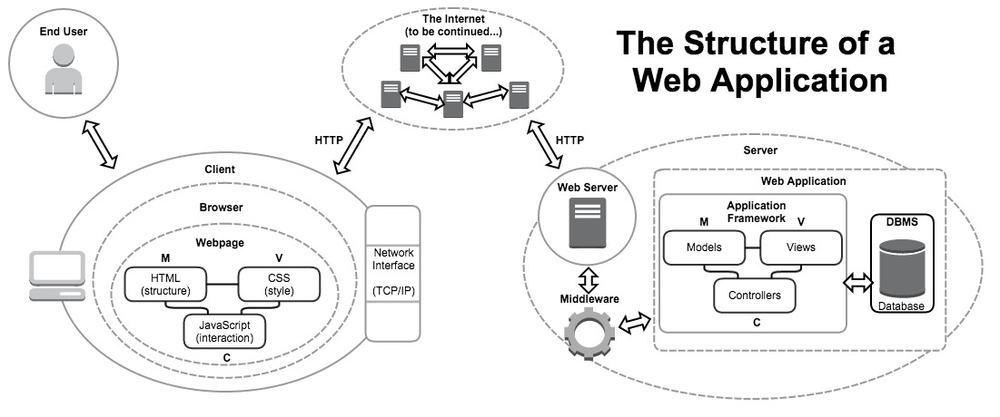

# What is WDI?

A framing and discussion about how to approach the immersive learning
environment, and key points about the Web Development Immersive.

## Our Course's Journey

#### Lesson Objectives

- Define "web application", and name some alternate types of programs.
- Describe the parts of a web application and the path our class will take to
  learn how to build them.

The purpose of this course is to learn the **fundamental concepts** and
**processes** of *creating programs*, something known as **software
development**.

#### Web Application Development

We will learn software development in the context of *networked* (more than
one computer) *applications* (another word for program, usually for one that
works as a stand-alone product) that communicate using *web* technologies
(HTTP, HTML, CSS & JavaScript): ie, **web applications**.

[Other types of
[development](http://jamesmccaffrey.wordpress.com/2006/04/24/the-7-types-of-software-development/)
include systems development, "native" application
development (specific to an OS, "ecosystem" or mobile device), and embedded,
scientific, or test/automation development. Often the people who do such work
append the term "engineer" to the terms above (such as an "automation
engineer"). Beyond just software development, however, programmers often work
in infrastructure or IT, doing jobs like system administration (ie
[*sysadmins](http://en.wikipedia.org/wiki/System_administrator)*), developer
operations (ie *devops](http://en.wikipedia.org/wiki/DevOps)*), or security.

#### Our Primary Goal

The purpose of this course is not to learn the specific technologies on the
syllabus, but to ***learn how to use any technology you can work with in
software development.***

#### Our Secondary Goals

However, we will judge our growth and build our projects using the
technologies outlined in our syllabus, and so we must also (thankfully)
***become competent junior programmers in these technologies***.

We must also ***learn the processes and pitfalls of working in a software
development job***: how to manage and share our code, how to distribute
workload, how to ask questions and when to ask them, among other skills.

#### Our Class's Learning Path

In order to reach this shared goal, the instructors of this class have used
their experience as programmers and as teachers to craft a specific learning
path. [**This is our _syllabus_**][syllabus].

No two classes have the same path; all classes share the same goals. We mostly
use the same technologies, but not always: *these technologies are largely
incidental to the goals of the class*. The plan is that, by the end of WDI,
**you can learn any new technology and begin creating software with it**,
regardless of what you learned to do in class.

A web application has a certain structure, and we must learn the parts of that
structure and how to combine them one-by-one. Here is that structure and the
path we will take to understand it as a whole:

##### Part I: Web Pages

We learn how to use "markup" (like Markdown and HTML) and "meta-data" 
languages, as well as some "domain specific languages (DSLs)" (like CSS) to
describe data or documents in rich ways, and how they can be used to build
user experiences.

##### Part II: Fundamentals of Programming

We learn how to write basic, procedural programs using the language of the web,
JavaScript. 

##### Part III: Building Web Applications

We learn about networking (HTTP) and the Internet, as well as the basic 
concepts involved in writing applications that exist *over networked computers*
using the client-server model. As our programs grow in complexity, we learn a
new model for organizing our code's logic: obect-oriented programming.

##### Part IV: Working with APIs

Now that we can create a full(-stack) networked application, we learn how to
create *part* of a networked application, either on the server- or client-side,
using application programming interfaces. We begin to think about, use and
structure our programs as services. We also begin to think about services,
libraries and frameworks as sharing a new model of programming to handle
greater complexity.

##### Part V: New Paths in Web Development

Finally we explore the most current formats for creating networked applications.
We explore other models of interaction other than client-server, and how to
build and deliver complex applications entirely within the client. We will use
client-side frameworks to build what are often called "single-page applications"
(SPAs).

---

## Your Learning Experience

#### Lesson Objectives

- Explain what is meant by *owning* your learning experience (active learning 
  as opposed to passive learning). 
- Explain the difference between taking notes and receiving notes,
  and why each is important. 
- Explain the purpose of lesson objectives in this classroom. 
- List the types of resources that students in this class should either 
  generate or gather, and why.

#### "Owning" Your Learning Experience

While people often discuss different types of learning, what is implicit in that
idea is that they are *thinking about how they learn.* That is incredibly
important to becoming a programmer, and therefore to this class. We will use
structures that help us think about how we learn best, and try to support you in
your growth as a learner, but in the end it is up to you to use this structure
**intentionally** to better yourself.

1. **Agile Methodology**: while Agile can become meaningless in the term's
  overuse, we will try and impart it's core concept of continuous imporovement
  by taking time to think about our porcesses and how we do things. Agile has
  key components that help us do this:
  - **Stand-ups**: stand-ups are short meetings where we reflect and share 
    exactly what our goals are for the day, and what problems we think we may 
    have in acheiving those goals.
  - **Sprints**: sprints are periods of active work, where we try to acheive 
    those goals.
  - **Retros**: retrospectives, or retros, are longer meetings where we explore
    and analyze how we did during a sprint, and try to ensure that we fix
    problems that have kept us from working (or learning) efficiently.
2. **Objectives**: in terms of our class, our goals are framed as **learning
  objectives**. These are straightforward descriptions of actions we can take
  to show that we understand a concept or can perform some programming action.
  Every lesson should be framed, beginning and end, by a return to the
  objectives for a lesson.
3. **Resources**: while learning to program, you will need every resource at
  your disposal. We will help you to gather cheatsheets (short reminders of
  how to do things by rote), notes (important points to remember from class),
  walkthroughs, examples and templates (actual code that you can go over to
  either build something or learn from example), tutorials (extended 
  explanations), and more. We will also point you to the many versions of these
  things that are out there already (there is SOOOOO MUCH!). Most importantly,
  however, is that you should learn to make these yourselves, and share them
  with each other.
4. **Asking questions**: ... this one is simple. ASK QUESTIONS! Always ask,
  because you should always know:
  - **What should I be *doing* right now?**
  - **What should I be *learning* right now?**
  - and then any question you have about the topic or content of that moment!

---

## Abstraction, Modeling, Encapsulation, and Interfaces

#### Lesson Objectives

- Define the term **abstraction**.
- Define the term **encapsulation**.
- Define the term **interfaces**.
- Define the term **modeling**.

*Take your own notes!* :smile:
