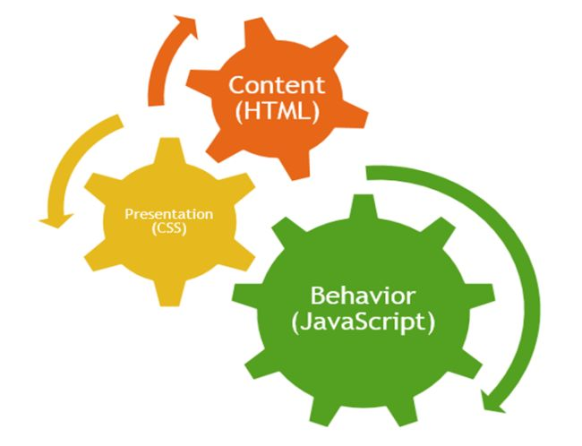

# Intro to JavaScript, Data Types & Variables

| Learning Objectives |
| :--- |
| Understand JavaScript's Data Types |
| Create and Use Variables |
| Create and Manipulate Arrays |

## Roadmap
1. Intro to JavaScript
2. Explore JavaScript's Data Types
3. Variables and Expressions
4. Type Conversion
5. Arrays
6. Array Practice

### 1. Intro to JavaScript

> "JavaScript is the world's most popular programming language."<br>
> _\- someone on the Internet that knows..._

__>>__

#### JavaScript's Role

The purpose of JavaScript is to provide behavior to our web applications via client-side script.



__>>__

With the invent of _Node.js_, JavaScript is also being used server-side. <br>Note: Node.js is a runtime environment that can execute JS code on most platforms, including our laptops.

__>>__

#### JavaScript Facts:

- Not to be confused with Java (although both have syntaxes based upon the "C" programming language).
- Created in 10 days in 1995 by Brendan Eich.
- JavaScript is a dynamic scripting language - it is interpreted by the JavaScript engine each execution.
- It's an object oriented programming (OOP) language despite not having _classes_, which other OOP languages use as "blueprints" for creating new objects. However, later you will learn that JS can use existing objects as blueprints instead.
- JavaScript is an implementation of ECMAScript, a standard maintained by the European Computer Manufacturers Association).
- Currently the version that is fully implemented by browsers is ECMAScript 5. However, ECMAScript 6, a major update that will bring classes and other goodness, is being implemented right now.  [This website](http://kangax.github.io/compat-table/es6/) reports the implementation status.

__>>__

### 2. Explore JavaScript's Data Types

Every piece of data has a _type_. Currently, JavaScript has are six data types (ES adds a new _symbol_ data type).


#### string

A _string_ represents textual data with zero or more characters wrapped by single or double quotation marks such as `"John"` or `'Jane'`. A pair of quotes with nothing between them is still a _string_ - an _empty string_.

#### number

A _number_ represents a numeric value. Unlike most other programming languages, there is no distinction between integer (`15`, `3`, etc.) and floating-point values (`17.24`, `3.1416`, etc.). Internally, JS represents all numbers as floating-point values.

#### boolean

Whereas strings and numbers can have a virtually unlimited number of different values, the _boolean_ data type only has two: __true__ and __false__.

<br>
__Before moving on, lets pair up and list of a couple examples where we might use each of the three data types we've covered thus far (string, number & boolean) in our programs.__

<br>

__>>__

__>>__

#### null

The _null_ data type has only one value: __null__. A variable with a value of _null_ contains no valid number, string, boolean or object.

#### undefined

A variable that has not been assigned a value is of type _undefined_. Also, a function returns _undefined_ if a value was not returned.

#### object

In JavaScript, _objects_ can be seen as a collection of properties. A properties consist of a key/value pair. _objects_ are everywhere.  JS has several different kinds of built-in objects, including:

- Array
- Date
- Math
- Function (yes, functions are objects!)

We will discuss _objects_ in detail in the next lesson.

#### What's a Primitive Data Type?

A _primitive_ data type holds only a value and has no methods (functions). Of the six data types, all but _objects_ are primitives. But "wait" you say, I've seen methods, such as _substring_, on string variables and _toFixed_ on numbers! Well, JS is very friendly and provides _primitive wrapper objects_ that "wrap" _strings_, _numbers_ & _booleans_ on __demand__.

### 3. Variables and Expressions

Enough theory - lets experiment with this stuff!

Before we continue, open a browser tab and press `option + cmd + j` to open what's known as the _console_ provided by Chrome's Developer Tools. The console will allow to experiment with some simple JS code.

#### Variables

_Variables_ are ubiquitous in computer programming. Think of _variables_ as containers in memory for storing data values.

We declare variables using the `var` keyword:

```javascript
var myVar;
```

We can also assign a value to a variable by using the assignment operator ,`=`:

```javascript
var name = "Fred Flintstone";
```

Multiple variables can be defined on a single line:

```javascript
var name = "Wilma", age, town = "Bedrock", rocks = 25 * 4, fun = true;

// above is equivalent to
var name = "Wilma";
var age;
var town = "Bedrock";
var rocks = 25 * 4;
var fun = true;
```

The name of a variable is called an _identifier_ and must be unique. For JS variable identifiers, we use the Lower Camel Case naming convention such as `myBigHouse`.

Identifiers in JS:

- Are case-sensitive
- Must begin with a letter
- Can contain letters, digits, underscores, and dollar signs

__Questions?__

#### Expressions

A JavaScript _expression_ is any unit of code that resolves to a value.

Typically, expressions use _operators_ to perform arithmetic or compare _operands_ (data values).

There are numerous operators as [documented here](https://developer.mozilla.org/en-US/docs/Web/JavaScript/Guide/Expressions_and_Operators).

__Take a couple of minutes to type a few expressions in the console. Be sure to also use _variables_ as  operands instead of just _literal_ values__

Example:

```javascript
var x = 25;
var y = 10;
var total;
total = x + y;

var s = 'Hello';
var hello = s + ' World';
var myString = "How's the weather today?";

var aTrueValue = true;
var isFalse = aTrueValue && false;
```

__Observations?__

Here are some docs regarding JS [strings](https://developer.mozilla.org/en-US/docs/Web/JavaScript/Reference/Global_Objects/String), [numbers](https://developer.mozilla.org/en-US/docs/Web/JavaScript/Reference/Global_Objects/Number) and the [Math object](https://developer.mozilla.org/en-US/docs/Web/JavaScript/Reference/Global_Objects/Math). 

__Now experiment in the console with some of the methods available on strings and numbers, including the methods from the Math object.__

Example:

```javascript
var s = "Hello";
s.length
"Hey".length

var n = 123.4567
var i = n.toFixed(2);
Math.min(6, 22, 17.5, 13, 3.14);

// calculate a random number between 0 and 19;
var r = Math.floor((Math.random() * 20));
```

Note how you can call a string method directly on a string literal.  However, because numbers often contain decimal points, we must wrap a number literal in parenthesis before the dot like this `(123.45).toFixed()`. However, calling methods on literals is rare...

__Care to share some of your examples?__

### 4. Type Conversion

JavaScript is very relaxed when it comes to data types. Contrary to non-dynamic languages, a variable can change its type.

```javascript
var m = 15;  // I'm a number
m = 'hey';   // Now I'm a string!
```

#### Checking Data Types

JavaScript provides a `typeof` operator that we can use to check data types.

```javascript
var s = 'Hello';
typeof s;  // returns "string"

var i = 123;
typeof i;  // returns "number"

typeof false;  // returns "boolean"

```

Note that `typeof` operator itself always returns a string.

However, probably due to the fact that JS was written in around 10 days, the typeof operator is a little quirky.  For example, contrast the type of `null` and `undefined`.

#### Beware of Implicit Conversion

JavaScript is friendly and tries to help us whenever it can. However, we all know that sometimes its better to be left alone.

__Try adding a string to a number.  What did JS do?__

__Now try comparing a number and a string containing the same digits using the equality (`==`) comparison operator__

```javascript
13 == "13"  // returns true!
```

This is why, unless there's a reason not to, use the _strict equality operator_ (`===`) as it will not perform type conversion. 

#### Explicit Type Conversion

We can easily convert a number to a string using the `toString()` and `toFixed()` methods:

```javascript
var n = 123.456;
var s1 = n.toString();  // "123.456"
var s2 = n.toFixed(2);  // "123.46"
```
Remember however, that the data type for both flavors, integer and float (short for floating-point), is _number_.

There are a couple of handy methods used to convert strings to numbers: `parseInt()` and `parseFloat()`

```javascript
var s = "1234.567";
var n1 = parseInt(s);  // 1234
var n2 = parseFloat(s);  // 1234.456
```

### 5. Arrays

#### What are Arrays?

- A data structure that is similar in concept to a list.
- Each item in an array is called an element.
- Can contain data of the same or different types.
- In JS, can dynamically grow and shrink in size.

#### Creating Arrays

There are two ways to create an array...

```javascript
// using a Constructor Function (less common syntax)
var superheroes = new Array("Batman", "Swamp Thing", "Spawn", "Captain Marvel");

// using Array Literal syntax (what you will use and see most of the time)
var superheroes = ["Batman", "Swamp Thing", "Spawn", "Captain Marvel"];
```

#### Accessing the Elements in an Array

We can access the first element in an array using _bracket notation_:

```javascript
var superheroes = ["Batman", "Swamp Thing", "Spawn", "Captain Marvel"];
var firstHero = superheroes[0];
```

Since when is `0` the first item in anything?  Since computer science came along!

__How would we access the value "Spawn"?__

>FYI, the individual characters in a string can be accessed using bracket notation also - try it!

#### Working with Arrays

Lets pair up and create an array containing a list of your favorite sports teams.

__>>__

Each pair will research one of the following Array methods to share with the class:

- `Array.length` (this is actually a property, not a method)
- `Array.push()`
- `Array.pop()`
- `Array.reverse()`
- `Array.shift()`
- `Array.unshift()`
- `Array.sort()`
- `Array.concat()`
- `Array.indexOf()`
- `Array.lastIndexOf()`
- `Array.join()`
- `Array.slice()`
- `Array.splice()`

#### Simple Iteration with a `for` loop

Iterating through the elements of an array, one at a time, is a very common practice in programming.

We can use a `for` loop to iterate over the elements of an array like this:

```javascript
var teams = ['Bruins', 'Cal Bears', 'Ravens', 'Ducks'];
for (var i = 0; i < teams.length; i++) {
	console.log(teams[i]);
}
```

### 6. Array Practice

JavaScript arrays have several advanced _iterator methods_.

Several of these methods require a function be supplied as an argument.

As an example, lets look at the `forEach` method that we can use instead of a `for` loop to iterate the elements:

```javascript
var teams = ['Bruins', 'Cal Bears', 'Ravens', 'Ducks'];
teams.forEach(function(el) {
    console.log(el);
});
```

Would you agree that this code's intention is clearer than that of the for loop?

Here are some other iterator methods for you to research and practice with:

- `Array.every()`
- `Array.some()`
- `Array.filter()`
- `Array.map()`

Use these arrays to practice with:

```javascript
var names1 = ["Plato", "Linus", "Rashad", "Aidan", "Hunter", "Rudyard", "Kaseem", "Armand", "Clayton"];
var names2 = ["Ferris", "Erich", "Alvin", "Brody", "Justin"];
```

__Questions?__

In the next lesson we will examine Objects!

## References

[MDN JavaScript Documentation](https://developer.mozilla.org/en-US/docs/Web/JavaScript)

